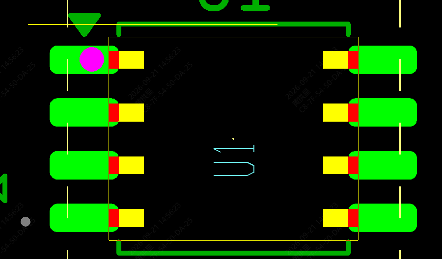

# ERR-003: Wrong footprint for U1

The board uses the 208 mil version of the SOIC-8 footprint, but the part number selected is the 150 mil version. As a consequence, the footprint is too small and this was flagged by JLCPCB.

## Cause

Human error.

## Patch

For the `v1.1.0` build, JLCPCB was instructed to instead use the part [C153760](https://jlcpcb.com/partdetail/onsemi-CAT24C512XIT2/C153760) which should be in a 208 mil SOIC-8 package. These boards are designated as `v1.1.1`.

## Fix

Update the board to instead use a 150 mil variant of the footprint.
