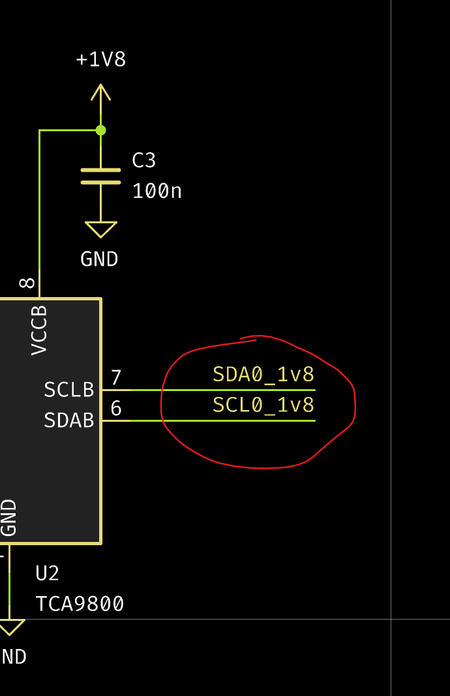

# ERR-005: I2C signals reversed on 1v8 side

I2C signals coming out of U2 are reversed.

## Cause

Human error.

## Patch

Cut the traces and solder in bodge wires on the 1v8 side.

## Fix

Move the signals to the correct pins.
