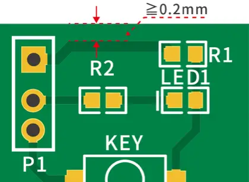
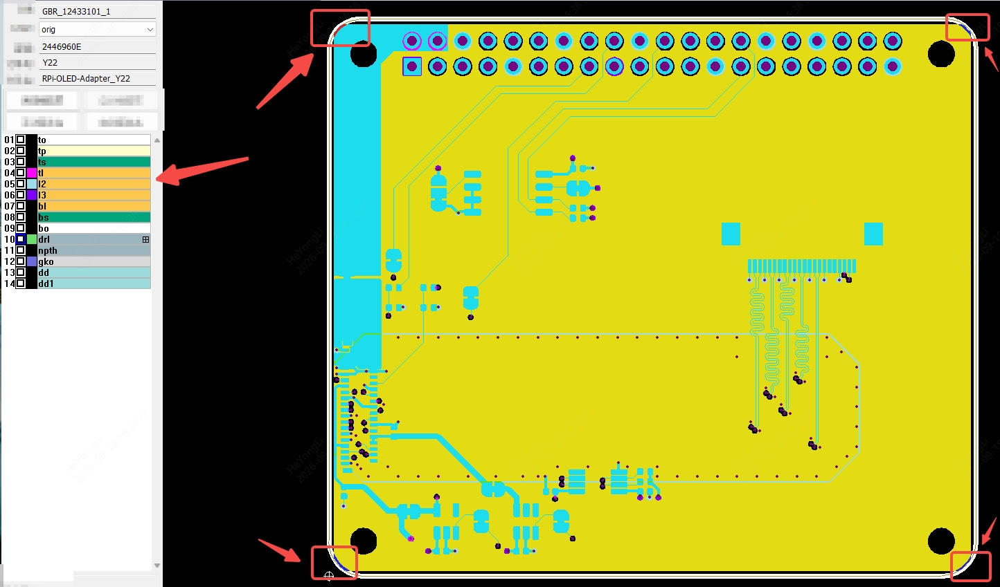
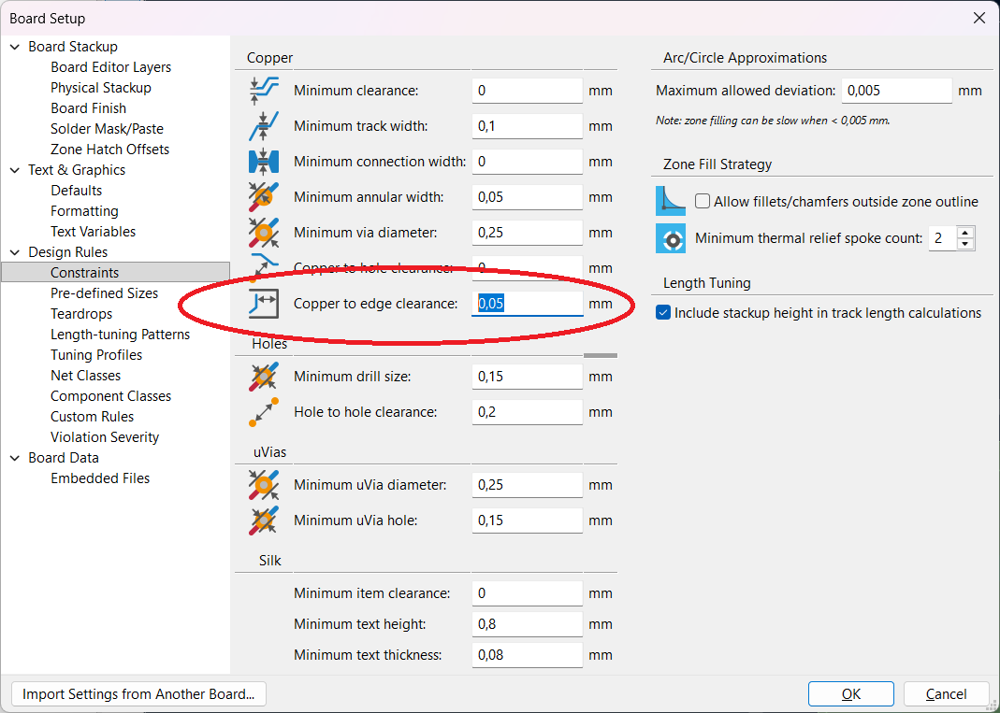

# RPi-OLED Adapter v1.0.0 Errata

## Errata E1

The production files were rejected by JLCPCB. Apparently, the inner layer copper fills intersected with the board edge keepout, which is defined as `≧0.2mm` for routed edges[^1].

[^1]: [https://jlcpcb.com/capabilities/pcb-capabilities](https://jlcpcb.com/capabilities/pcb-capabilities#:~:text=Copper%20clearance%20from%20routed%20board%20edges%3A%20%E2%89%A70.2%20mm)

The issue arises at all four corners of the board as shown in the screenshort from JLCPCB.

## Cause

It seems KiCAD has a very small default value for `Copper to edge clearance`. It looked better along the edges because the zones had been offset 0.25mm from the board edge.

## Fix

Increase the clearance value to `0.50mm`.
Extend the zone border for all layers to follow the board edge exactly.

## Errata E2

There are no markings on the board indicating revision.

## Cause

This was not done before the release of v1.0.0.

## Fix

Add correct markings for v1.1.0.
